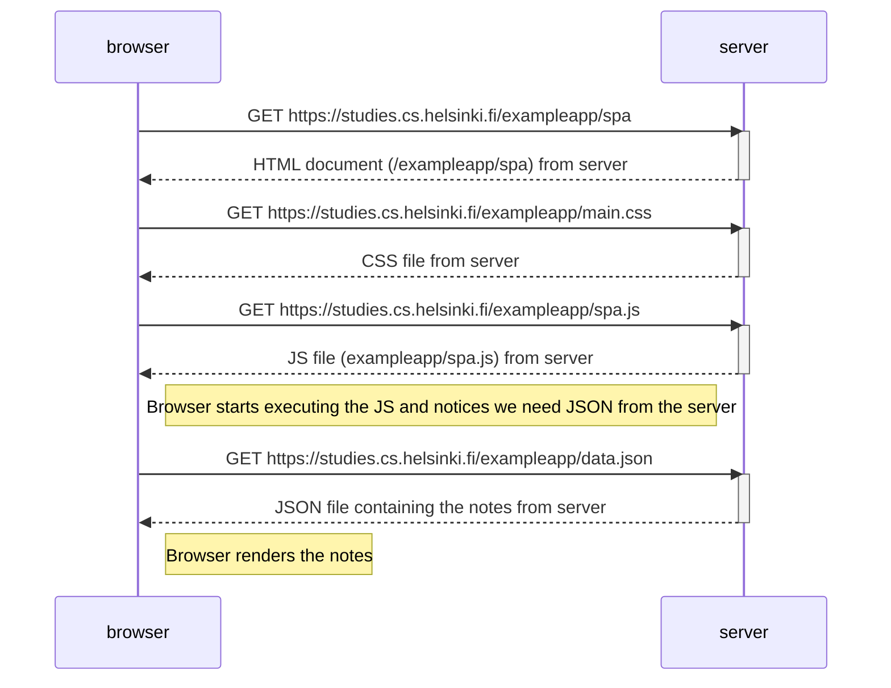

# Sequence diagram of user going to SPA version of site
## This diagram shows what happens when loading this site:
## <https://studies.cs.helsinki.fi/exampleapp/spa>

```mermaid
sequenceDiagram
    participant browser
    participant server

    browser->>server: GET https://studies.cs.helsinki.fi/exampleapp/spa
    activate server
    server-->>browser: HTML document (/exampleapp/spa) from server
    deactivate server

    browser->>server: GET https://studies.cs.helsinki.fi/exampleapp/main.css
    activate server
    server-->>browser: CSS file from server
    deactivate server

    browser->>server: GET https://studies.cs.helsinki.fi/exampleapp/spa.js
    activate server
    server-->>browser: JS file (exampleapp/spa.js) from server
    deactivate server

    Note right of browser: Browser starts executing the JS and notices we need JSON from the server

    browser->>server: GET https://studies.cs.helsinki.fi/exampleapp/data.json
    activate server
    server-->>browser: JSON file containing the notes from server
    deactivate server

    Note right of browser: Browser renders the notes
```

