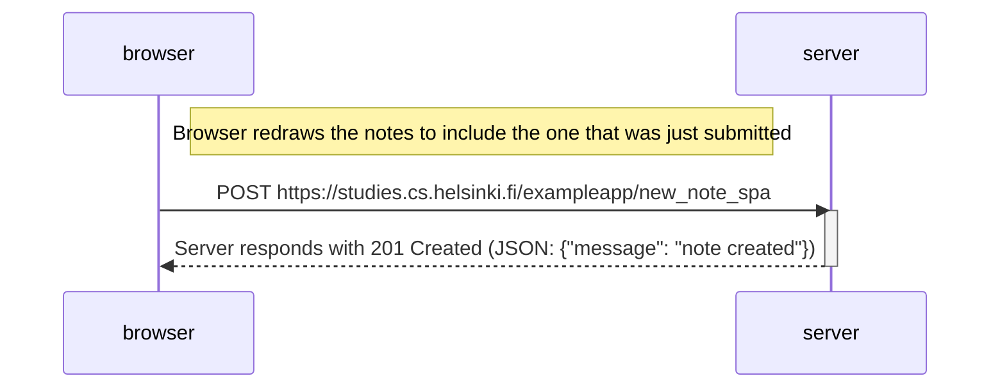

# Sequence diagram of user adding a note in SPA version
## This diagram shows what happens when user submits a note on this site:
## <https://studies.cs.helsinki.fi/exampleapp/spa>

```mermaid
sequenceDiagram
    participant browser
    participant server

    Note right of browser: Browser redraws the notes to include the one that was just submitted

    browser->>server: POST https://studies.cs.helsinki.fi/exampleapp/new_note_spa
    activate server
    server-->>browser: Server responds with 201 Created (JSON: {"message": "note created"})
    deactivate server
```

